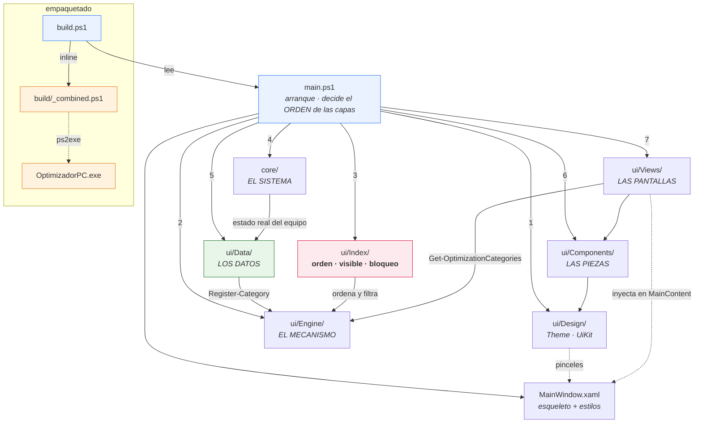
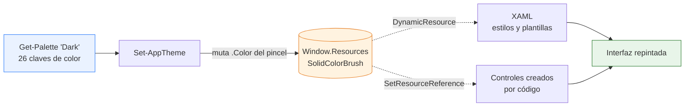
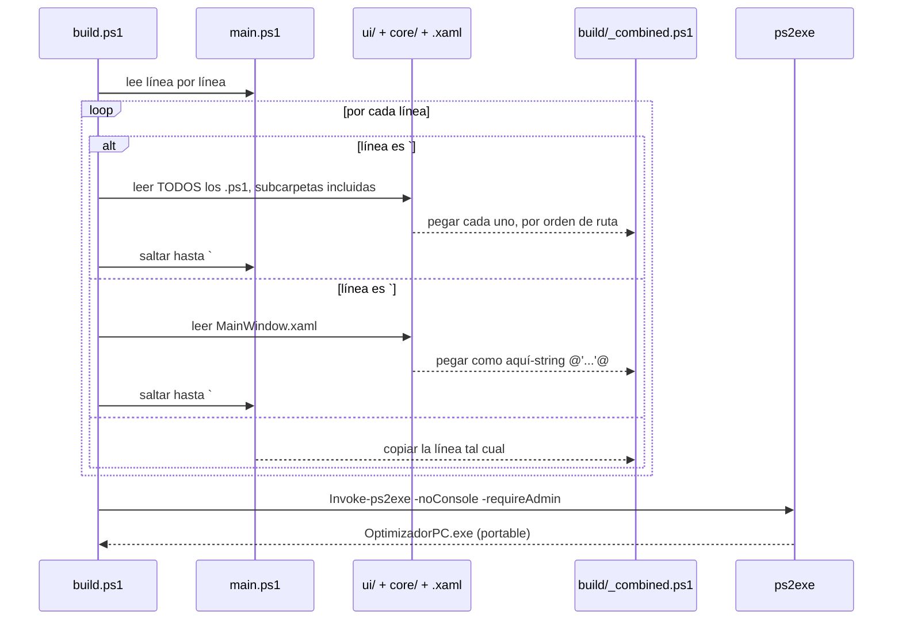

# Optimizador PC

Aplicación de escritorio para optimizar Windows 11 Pro. Interfaz **WPF** escrita íntegramente en **PowerShell 5.1** y empaquetada como un **`.exe` portable de un solo archivo** con [ps2exe](https://github.com/MScholtes/PS2EXE).

> **Estado: maqueta de interfaz.** La navegación, las tarjetas, los toggles y los dropdowns funcionan visualmente, pero **ningún control aplica cambios reales al sistema todavía**. Los datos de `ui/Data/Categories/` son estáticos.

---

## Estructura del proyecto

Cada archivo tiene **una sola responsabilidad**. La regla general: para cambiar algo,
solo deberías tener que abrir un archivo.

```
Proyecto/
├── main.ps1                 Arranque: carga todo, aplica preferencias, conecta la ventana
├── build.ps1                Empaquetador (inline) + compilador a .exe
├── OptimizadorPC.exe        Binario portable generado
│
├── core/                    EL SISTEMA. Habla con Windows, no con la pantalla.
│   ├── Registry/            Todo lo del registro de Windows
│   │   ├── Reader.ps1           Lectura del registro (hoy, solo lectura)
│   │   └── CategoryState.ps1    Vuelca en los ajustes lo que hay en el equipo
│   └── Diagnostics/
│       └── Log.ps1              Registro de actividad: qué se leyó y cuándo
│
├── ui/                      UNA CARPETA POR CAPA. Ver "Las capas" más abajo.
│   ├── MainWindow.xaml      ESQUELETO + ESTILOS: barra de título, contenedores
│   │                        vacíos y todas las plantillas visuales
│   │
│   ├── Design/              1. BASE. Por debajo de todo; no usan a nadie.
│   │   ├── Theme.ps1            Paletas claro/oscuro, iconos, animaciones
│   │   └── UiKit.ps1            Piezas genéricas: icono, píldora, etiqueta,
│   │                            interruptor, buscador, botón chip, rejillas
│   │
│   ├── Engine/              2. MECANISMO. Registran, traducen, guardan, enrutan.
│   │   ├── CategoryRegistry.ps1   Declarar secciones y sus ajustes
│   │   ├── PreferenceRegistry.ps1 Declarar opciones de Settings
│   │   ├── Translation.ps1        Traducción (T, Register-Language)
│   │   ├── AppSettings.ps1        Guardado en %APPDATA% entre sesiones
│   │   └── Router.ps1             Qué pantalla se ve y cómo repintarla
│   │
│   ├── Index/               3. POLÍTICA. ← LOS ARCHIVOS PRINCIPALES
│   │   ├── CategoryIndex.ps1    qué secciones se ven, en qué orden,
│   │   │                        y cuáles están bloqueadas
│   │   ├── NavigationIndex.ps1  los botones del menú lateral
│   │   ├── LanguageIndex.ps1    los idiomas disponibles
│   │   └── ViewOptionsIndex.ps1 las casillas del botón "Vista"
│   │
│   ├── Data/                5. LOS DATOS. Solo declaraciones, cero UI.
│   │   ├── Categories/          Un archivo por sección
│   │   │   ├── Regedit.ps1          Power.ps1          Gaming.ps1
│   │   │   └── Update.ps1           Notifications.ps1  Sound.ps1
│   │   ├── Preferences/         Un archivo por opción de Settings
│   │   │   ├── 10-Language.ps1
│   │   │   └── 20-Theme.ps1
│   │   └── Lang/                Un archivo por idioma
│   │       └── es.ps1               (el inglés es la fuente: no lleva archivo)
│   │
│   ├── Components/          6. LAS PIEZAS. Cómo se dibuja cada cosa.
│   │   ├── Shell/               El marco de la ventana
│   │   │   ├── TitleBar.ps1         textos e iconos de la barra de título
│   │   │   ├── Sidebar.ps1          menú lateral: botones y plegado animado
│   │   │   ├── ViewMenu.ps1         chip "Vista" y su desplegable
│   │   │   ├── LogPanel.ps1         cajón del registro de actividad
│   │   │   └── ProgressStrip.ps1    barra de progreso del pie
│   │   ├── Cards/               Las tarjetas
│   │   │   ├── CategoryCard.ps1     fila de la pantalla principal
│   │   │   ├── SettingCard.ps1      fila de la pantalla de detalle
│   │   │   ├── PreferenceCard.ps1   fila de la pantalla de Settings
│   │   │   └── TechnicalDetails.ps1 pie plegable con las claves del registro
│   │   └── Layout/              Piezas de página
│   │       ├── PageHeader.ps1       cabecera: título, breadcrumb, acciones
│   │       ├── Banner.ps1           avisos (p. ej. "sección bloqueada")
│   │       └── CategorySummary.ps1  la fila de píldoras bajo el título
│   │
│   └── Views/               7. LAS PANTALLAS. Solo ensamblan piezas.
│       ├── OptimizationsListView.ps1
│       ├── CategoryDetailView.ps1
│       └── SettingsView.ps1
│
├── tests/                   PRUEBAS. Sin dependencias, corren en 5.1 y en 7.
│   ├── Run-Tests.ps1        El lanzador
│   ├── Harness/             EL ARNÉS: no prueba, hace que se pueda probar
│   │   ├── TestKit.ps1          Describe / It / Assert-*
│   │   ├── AppHost.ps1          Carga la app sin abrir la ventana
│   │   └── Fixtures.ps1         Claves de prueba, secciones de mentira
│   ├── Core/                Pruebas de core/, contra el registro de verdad
│   ├── Ui/                  Pruebas de ui/, con controles de WPF sin ventana
│   ├── Source/              Pruebas del código fuente, sin ejecutarlo
│   └── README.md            Cómo lanzarlas y qué cubren
│
└── build/
    └── _combined.ps1        GENERADO: todo el proyecto en un solo script
```

### Las capas y su orden

Los números del árbol son **el orden en que `main.ps1` carga las carpetas**, y es lo
único que ese archivo decide sobre la estructura. Importa por una sola razón: los
datos se registran al cargarse, así que su mecanismo tiene que existir antes
(`ui/Data/Categories/` llama a `Register-Category`, que vive en `ui/Engine/`).
`core/` va en el puesto 4, entre la política y los datos.

**Cada capa se carga entera, subcarpetas incluidas.** Un `.ps1` nuevo en cualquiera de
ellas entra solo, tanto al ejecutar `main.ps1` como al compilar el `.exe`: no hay que
registrarlo en ningún sitio. Lo que **no** se puede es dejar un archivo suelto fuera
de esas carpetas — no habría forma de meterlo en el ejecutable.

### ¿Dónde toco qué?

| Quiero... | Voy a... |
| --------- | -------- |
| Reordenar, ocultar o bloquear secciones | `ui/Index/CategoryIndex.ps1` — **el principal de las secciones** |
| Reordenar, ocultar o bloquear botones del menú | `ui/Index/NavigationIndex.ps1` — **el principal del menú** |
| Añadir o quitar una casilla del botón "Vista" | `ui/Index/ViewOptionsIndex.ps1` — **el principal de la vista** |
| Añadir o quitar un idioma | `ui/Data/Lang/` + `ui/Index/LanguageIndex.ps1` |
| Añadir una opción a Settings | Crear un archivo en `ui/Data/Preferences/` |
| Traducir un texto | `ui/Data/Lang/es.ps1` |
| Añadir una sección (Network, Storage...) | Crear un archivo en `ui/Data/Categories/` |
| Añadir/quitar un ajuste dentro de una sección | Editar el array `Items` de ese archivo |
| Cambiar el icono o el color de una sección | Campos `Icon` / `Accent` de ese archivo |
| Cambiar cómo se ve una fila de la lista | `ui/Components/Cards/CategoryCard.ps1` |
| Cambiar cómo se ve una fila del detalle | `ui/Components/Cards/SettingCard.ps1` |
| Cambiar el título o los botones de la cabecera | `ui/Components/Layout/PageHeader.ps1` |
| Cambiar el plegado del menú o su animación | `ui/Components/Shell/Sidebar.ps1` |
| Cambiar colores, tipografías o iconos globales | `ui/Design/Theme.ps1` |
| Cambiar bordes, sombras o plantillas de controles | `ui/MainWindow.xaml` |
| Añadir una pantalla nueva | Crear un archivo en `ui/Views/` y apuntarla desde `ui/Index/NavigationIndex.ps1` |
| Tocar cómo se lee el registro | `core/Registry/Reader.ps1` — nada de WPF aquí dentro |
| Cambiar qué claves consulta un ajuste | El `-Registry` de ese ajuste en `ui/Data/Categories/` |

**Las siete carpetas de capa se cargan enteras, subcarpetas incluidas.** Un `.ps1`
nuevo dentro de cualquiera entra solo — no hay que registrarlo en `main.ps1` ni en
`build.ps1`.

### El índice de secciones

`ui/Index/CategoryIndex.ps1` es **el archivo principal de las secciones**. Manda sobre
cuáles se ven, en qué orden y cuáles están bloqueadas. El contenido de cada una
sigue en su propio archivo de `ui/Data/Categories/`.

```powershell
$CategoryIndex = @(

    #  Id                    Visible          Bloqueada
    @{ Id = 'regedit';       Visible = $true;  Locked = $false }
    @{ Id = 'power';         Visible = $true;  Locked = $false }
    @{ Id = 'gaming';        Visible = $true;  Locked = $false }
    @{ Id = 'update';        Visible = $true;  Locked = $false }
    @{ Id = 'notifications'; Visible = $true;  Locked = $false }
    @{ Id = 'sound';         Visible = $true;  Locked = $false }

)
```

| Quiero... | Hago |
| --------- | ---- |
| Mover una sección arriba o al final | Mover su línea en la lista |
| Ocultarla sin perderla | `Visible = $false` |
| Mostrarla pero que no se pueda tocar | `Locked = $true` |
| Quitarla temporalmente | Comentar su línea con `#` |
| Volver a ponerla | Descomentar la línea |

Ocultar o quitar del índice **no borra nada**: el archivo de `ui/Data/Categories/` sigue
intacto y la sección vuelve en cuanto la reactivas.

**Qué hace `Locked = $true`:** la sección aparece en la lista con un candado, se puede
abrir y consultar, pero dentro sale un aviso, los interruptores y desplegables quedan
deshabilitados en gris y el botón *Reset* se apaga. No es solo un efecto visual —
los controles llevan `IsEnabled = $false`, así que WPF no les entrega el ratón.

**Y si creo un archivo y no lo pongo en el índice:** aparece igualmente, al final de
la lista y desbloqueado. Así añadir una sección sigue siendo crear un archivo y ya;
el índice solo hace falta cuando quieres colocarla, ocultarla o bloquearla.
`Get-UnlistedCategories` devuelve las que están en ese caso.

### El menú lateral

`ui/Index/NavigationIndex.ps1` hace con los botones de la izquierda lo mismo que
`CategoryIndex.ps1` con las secciones. Antes estaban escritos a mano en el XAML;
ahora son datos y los dibuja `ui/Components/Shell/Sidebar.ps1`.

```powershell
$NavigationIndex = @(

    #  Id             Icono        Etiqueta       Grupo      Visible  Bloqueado
    @{ Id = 'software';  Icon = 'Apps';    Label = 'Software';  Group = 'Top';    Visible = $true; Locked = $false }
    @{ Id = 'optimize';  Icon = 'Gauge';   Label = 'Optimize';  Group = 'Top';    Visible = $true; Locked = $false; Default = $true }
    @{ Id = 'customize'; Icon = 'Palette'; Label = 'Customize'; Group = 'Top';    Visible = $true; Locked = $false }

    @{ Id = 'advanced';  Icon = 'Wrench';  Label = 'Advanced';  Group = 'Bottom'; Visible = $true; Locked = $false }
    @{ Id = 'settings';  Icon = 'Gear';    Label = 'Settings';  Group = 'Bottom'; Visible = $true; Locked = $false }
    @{ Id = 'more';      Icon = 'More';    Label = 'More';      Group = 'Bottom'; Visible = $true; Locked = $false }

)
```

| Campo | Para qué |
| ----- | -------- |
| Orden de la lista | El orden en que salen los botones, dentro de cada grupo |
| `Group` | `'Top'` arriba, `'Bottom'` pegado abajo tras la línea separadora |
| `Visible` | `$false` lo oculta sin borrar nada |
| `Locked` | `$true` lo muestra con candado, en gris y sin responder al clic |
| `Default` | El botón que sale marcado al arrancar |
| `Icon` | Nombre de glifo del catálogo de `ui/Design/Theme.ps1` |

Añadir una entrada al menú es añadir una línea aquí. Aunque los botones ya no estén
en el XAML, siguen registrados con su nombre, así que `$Window.FindName('NavSettings')`
funciona igual que antes.

### Plegar el menú

El botón de las tres líneas de la barra de título pliega y despliega el panel con una
animación de 220 ms (`CubicEase`): el ancho baja de 88 px a 0 y el contenido se
desvanece un poco antes para que no se vea recortado a medio camino.

Se anima el **ancho del `Border`**, no la columna del `Grid`: la columna es `Auto` y
sigue al `Border` sola. Animar un `GridLength` directamente requeriría una animación
propia, porque WPF no trae ninguna. El borde derecho de 1 px se retira al plegar,
que si no el ancho nunca llegaría a cero del todo.

### Idiomas

La traducción es **por texto original**, no por clave: el inglés es el idioma fuente y
cada archivo de `ui/Data/Lang/` es un diccionario `"texto en inglés" -> "texto traducido"`.
Gracias a eso los archivos de `ui/Data/Categories/` **no se tocan**: siguen leyéndose en
inglés claro, y aun así su contenido se traduce.

```powershell
# ui/Data/Lang/es.ps1
Register-Language 'es' @{
    'Optimizations'      = 'Optimizaciones'
    'Windows registry keys' = 'Claves de registro de Windows'
    'Game Mode'          = 'Modo de juego'
    '{0} settings'       = '{0} ajustes'
}
```

En el código, cada texto visible pasa por `T`:

```powershell
$title.Text = T 'Optimizations'
$count.Text = (T '{0} settings') -f $Category.Items.Count
```

Si falta una traducción sale el original en inglés, nunca un error. Para saber qué
queda pendiente, navega por la aplicación y ejecuta `Get-MissingTranslations 'es'`:
`T` va anotando todo lo que se le pide, así que devuelve exactamente lo que falta.

**Para añadir un idioma:**

1. copiar `ui/Data/Lang/es.ps1` como `ui/Data/Lang/<código>.ps1` y traducir
2. añadir su línea en `ui/Index/LanguageIndex.ps1`

Nada más. La carpeta `ui/Data/Lang/` se carga entera, y el desplegable de Settings se
rellena solo desde el índice.

> Los nombres de los idiomas (`English`, `Español`) **no** se traducen a propósito:
> van siempre en su propio idioma, que es como los reconoce quien los busca. Eso lo
> marca el campo `TranslateOptions = $false` de `ui/Data/Preferences/10-Language.ps1`.

**Por qué hace falta repintar:** el tema claro/oscuro se actualiza solo porque el XAML
usa `DynamicResource`, pero para el texto no existe equivalente. Al cambiar de idioma,
`Update-UiLanguage` reconstruye el menú y vuelve a dibujar la pantalla actual usando
el enrutador (`ui/Engine/Router.ps1`), que recuerda en qué vista estás.

### Preferencias

La pantalla Settings **se dibuja sola** a partir de `ui/Data/Preferences/`. Añadir una
opción es crear un archivo ahí; la vista no se toca.

```powershell
# ui/Data/Preferences/30-MiOpcion.ps1
Register-Preference @{
    Order       = 30
    Id          = 'miopcion'
    Group       = 'General'          # cabecera bajo la que se agrupa
    Label       = 'My option'        # se traduce
    Description = 'What it does'     # se traduce
    Type        = 'Toggle'           # 'Toggle' o 'Choice'

    Get = { Get-AppSetting 'MiOpcion' -Default $false }
    Set = {
        param($Value)
        Set-AppSetting 'MiOpcion' $Value
    }
}
```

`Type = 'Choice'` añade un desplegable y necesita `Options`, que puede ser un array
fijo o un scriptblock si la lista es dinámica (así se rellenan los idiomas).

### Qué se recuerda entre sesiones

Las preferencias se guardan en `%APPDATA%\OptimizadorPC\settings.json`:

```json
{
    "Theme":  "Dark",
    "Language":  "es"
}
```

Ahí y no junto al `.exe` a propósito: el ejecutable es portable y puede acabar en una
carpeta sin permisos de escritura. Si el archivo no existe o está corrupto, se ignora
y se arranca con los valores por defecto — nunca impide abrir el programa.

Guardar algo nuevo no requiere tocar nada: `Set-AppSetting 'Loquesea' $valor`.

### Cómo se declara una sección

```powershell
Register-Category @{
    Id          = 'network'             # identificador único
    Name        = 'Network & Latency'   # título visible
    Icon        = 'Bolt'                # glifo del catálogo de Theme.ps1
    Accent      = 'Accent'              # color del icono (clave del tema)
    AccentSoft  = 'AccentSoft'          # fondo del icono
    Badge       = 'NEW 3'               # distintivo rojo ($null para ocultarlo)
    Description = 'TCP tuning, Nagle, DNS, adapter power'

    Recommended = 11; Default = 14; Custom = 1; Total = 26

    Items = @(
        New-Setting -Name 'Nagle Algorithm' `
            -Description 'Disable packet coalescing to reduce input latency' `
            -Tags 'Recommended' `
            -Value $false

        New-Setting -Name 'DNS Provider' `
            -Description 'Choose which resolver Windows uses' `
            -Tags 'Custom' `
            -Options 'Automatic (DHCP)', 'Cloudflare 1.1.1.1', 'Google 8.8.8.8' `
            -Value 'Cloudflare 1.1.1.1'
    )
}
```

`New-Setting` deduce el control solo: **con `-Options` es un desplegable, sin
`-Options` es un interruptor** (y entonces `-Value` debe ser `$true` / `$false`).
Solo `Id`, `Name`, `Icon`, `Description` e `Items` son obligatorios; el resto tiene
valores por defecto.

### Diagrama de módulos



Las flechas numeradas son **el orden de carga**; las demás, quién usa a quién. Nótese
que ninguna sale de `core/` hacia `ui/Components` o `ui/Views`: `core/` no conoce la
interfaz.

### Sistema de diseño

Toda la apariencia sale de un único sitio: los recursos de `MainWindow.xaml`.

| Capa | Dónde | Qué aporta |
| ---- | ----- | ---------- |
| Paleta | `Theme.ps1` → `Get-Palette` | 26 claves de color, en versión clara y oscura |
| Recursos | `MainWindow.xaml` → `Window.Resources` | Las mismas 26 claves como `SolidColorBrush` |
| Estilos | `MainWindow.xaml` | Plantillas de botón, combo, scrollbar, tooltip, tarjeta |
| Componentes | `UiKit.ps1` | Iconos, píldoras, etiquetas, toggle animado, buscador |
| Tipografía | Segoe UI Variable (Display / Text) | Fuente nativa de Windows 11 |
| Iconos | Segoe Fluent Icons | Vectoriales, nativos, sin dependencias externas |

**Cambio de tema en vivo:** el XAML consume los colores con `{DynamicResource}` y el
código con `SetResourceReference`, así que `Set-AppTheme` solo tiene que reescribir
el color de cada pincel y toda la interfaz —incluida la ya construida— se repinta
sola, sin reconstruir ninguna vista.



## Cómo funciona la interfaz

`MainWindow.xaml` define un shell fijo (barra de título sin bordes, sidebar de navegación y cabecera). Las vistas **no** son archivos XAML: se construyen en código y se inyectan en tres contenedores nombrados.

| Contenedor XAML      | Qué recibe                                    |
| -------------------- | --------------------------------------------- |
| `HeaderTitleArea`    | Título grande o breadcrumb                     |
| `HeaderActionsArea`  | Buscador, "Quick Actions", "View"              |
| `MainContent`        | El cuerpo de la vista (lista de tarjetas)      |

Las vistas no tocan esas zonas directamente: pasan por `ui/Components/Layout/PageHeader.ps1`, que las limpia y las repuebla. Así **cambiar de pantalla no recrea la ventana** y todas las pantallas comparten el mismo aspecto de cabecera.

### Efectos y transiciones

| Efecto | Dónde vive | Detalle |
| ------ | ---------- | ------- |
| Entrada de vista | `Start-EnterTransition` | Desvanecido + deslizamiento de 14px, 260 ms, `CubicEase` |
| Elevación de tarjeta | `Add-HoverLift` | Sube 2px y la sombra pasa de 8 a 20 de desenfoque, 160 ms |
| Interruptor | `New-ToggleSwitch` | `ColorAnimation` de la pista + `DoubleAnimation` del pomo |
| Estados hover/foco | Triggers del XAML | Borde, fondo y color de texto por `ControlTemplate.Triggers` |
| Selección lateral | `DataTrigger` sobre `Tag` | Píldora de acento + barra indicadora |
| Scrollbar | Plantilla propia | 6px, se ensancha a 8px al pasar el ratón |

Las animaciones que usan `RenderTransform` o `Effect` **crean la instancia en código**,
no en un `Setter` del estilo: un `Freezable` declarado en un `Setter` se comparte entre
todos los controles del estilo y WPF no deja animarlo.

### Flujo de navegación


### Categorías definidas

Una fila por archivo de `ui/Data/Categories/`. El orden mostrado es el de `ui/Index/CategoryIndex.ps1`:

| Archivo | Id | Categoría | Icono | Badge | Ajustes |
| ------- | -- | --------- | ----- | ----- | ------- |
| `Regedit.ps1` | `regedit` | Regedit | `Shield` | NEW 3 *(contado)* | 6 |
| `Power.ps1` | `power` | Power | `Power` | — | 3 |
| `Gaming.ps1` | `gaming` | Gaming & Performance | `Game` | NEW 16 *(a mano)* | 5 |
| `Update.ps1` | `update` | Update | `Sync` | NEW 1 *(a mano)* | 2 |
| `Notifications.ps1` | `notifications` | Notifications | `Bell` | — | 2 |
| `Sound.ps1` | `sound` | Sound | `Volume` | — | 1 |

> **El badge se cuenta solo** a partir de los ajustes que llevan su propio `-Badge 'NEW'`: una categoría que no declare `Badge` sale con `NEW <n>`, o sin badge si no hay ninguno marcado. `Gaming.ps1` y `Update.ps1` todavía lo declaran a mano; borrar esa línea los pasa al recuento automático.
>
> Los contadores de las píldoras (`29/88`, etc.) siguen siendo **valores fijos declarados a mano**, no cuentan los ajustes reales del archivo. Cuando haya lógica real conviene calcularlos.


---

## Compilación

`build.ps1` existe porque ps2exe solo acepta **un** archivo de entrada, y el `.exe` debe ser portable sin arrastrar la carpeta `ui/` al lado.



### Comandos

```powershell
# Desarrollo: ejecutar directo, sin compilar (mucho más rápido)
powershell -ExecutionPolicy Bypass -File .\main.ps1

# Compilar el ejecutable portable
powershell -ExecutionPolicy Bypass -File .\build.ps1

# Solo empaquetar, sin llamar a ps2exe (rápido, para comprobar que todo entra)
powershell -ExecutionPolicy Bypass -File .\build.ps1 -CombineOnly
```

`build.ps1` instala el módulo `ps2exe` automáticamente en `CurrentUser` si falta (no requiere admin para instalarlo). El `.exe` resultante se compila con `-requireAdmin`, así que **pedirá elevación al abrirse**.

---

## Pruebas

```powershell
powershell -ExecutionPolicy Bypass -File .\tests\Run-Tests.ps1   # Windows PowerShell 5.1
pwsh       -ExecutionPolicy Bypass -File .\tests\Run-Tests.ps1   # PowerShell 7
```

Sin dependencias: no usan Pester ni hay nada que instalar. Pásalas en **los dos hosts**, por el mismo motivo de la convención 6.

Cubren cuatro cosas:

- **`core/`** contra el registro de Windows de verdad — los cuatro estados de lectura, el DWord con signo, y que nada suba una excepción hacia la ventana.
- **La interfaz**, construyendo controles de WPF reales pero sin enseñar la ventana: que estén los nombres que busca `FindName`, que cada vista se pinte, que el cambio de tema repinte los pinceles y que no quede ni un texto sin traducir.
- **El cableado de `main.ps1`**: levantan la ventana y pulsan los botones. Es la única forma de cazar la convención 4, porque un manejador con closure falla *al hacer clic* y solo ejecutando `main.ps1`.
- **Las reglas del proyecto** que se comprueban leyendo el código: el BOM, los `.GetNewClosure()`, los glifos inventados, y que ningún archivo se quede fuera del `.exe`.

Detalles en [`tests/README.md`](tests/README.md), que además explica **por qué Playwright no sirve aquí** (automatiza navegadores; esto es WPF) y qué haría falta para llegar a pruebas de extremo a extremo con UI Automation.

---

## Convenciones importantes

1. **Nunca edites `build/_combined.ps1`** — se regenera en cada build.
2. **`build.ps1` solo entiende dos marcadores de `main.ps1`:** `# @@EMBED_DIR:carpeta@@` (una capa entera, subcarpetas incluidas) y `# @@EMBED_XAML:ruta@@`, ambos cerrados con `# @@ENDEMBED@@`. **Un archivo nuevo va DENTRO de una de las siete carpetas de capa** y entonces entra solo; no hay forma de incluir uno suelto, y cargarlo a mano con un `. (Join-Path ...)` haría que el programa funcionase en desarrollo y fallara compilado. Hay una prueba que lo impide.
3. **Guarda todo `.ps1` y `.xaml` en UTF-8 CON BOM.** Windows PowerShell 5.1 interpreta un script sin BOM como ANSI y rompe cualquier carácter no ASCII, fallando al parsear. Como PowerShell 7 sí asume UTF-8, un archivo puede funcionar en `pwsh` y reventar en `powershell`.
4. **Los handlers de eventos no deben usar `.GetNewClosure()`.** El closure los liga a un módulo dinámico donde las funciones del script son invisibles (*"Show-CategoryDetailView is not recognized"* al hacer clic). Pasa el dato por `$control.Tag` y obtén la ventana con `[System.Windows.Window]::GetWindow($s)`.
5. **Sin consola en el `.exe`**: `Write-Host` no se ve. Depura ejecutando `main.ps1` directamente.
6. **Prueba en los dos hosts.** El `.exe` corre en ámbito global bajo PowerShell 5.1 y `main.ps1` en ámbito de script bajo PowerShell 7: hay fallos que solo se manifiestan en uno. Que el `.exe` funcione no significa que el script esté bien, y viceversa.

---

## Pendiente

- [ ] Lógica real de tweaks (registro, servicios, planes de energía) en módulos separados de `ui/`
- [ ] Leer el estado real del sistema en vez del `Value` estático de los archivos de `ui/Data/Categories/`
- [ ] Restauración / rollback por tweak
- [ ] Diferenciar las 6 entradas del sidebar (hoy las seis abren la misma vista)
- [ ] Funcionalidad de búsqueda, "Quick Actions", "View" y "Reset" (hoy son decorativos)
- [ ] Recordar el tema elegido entre sesiones
- [ ] Contadores de estadísticas calculados en vez de fijos
- [ ] Prueba de humo sobre el `.exe` compilado con `System.Windows.Automation` (ver `tests/README.md`)
