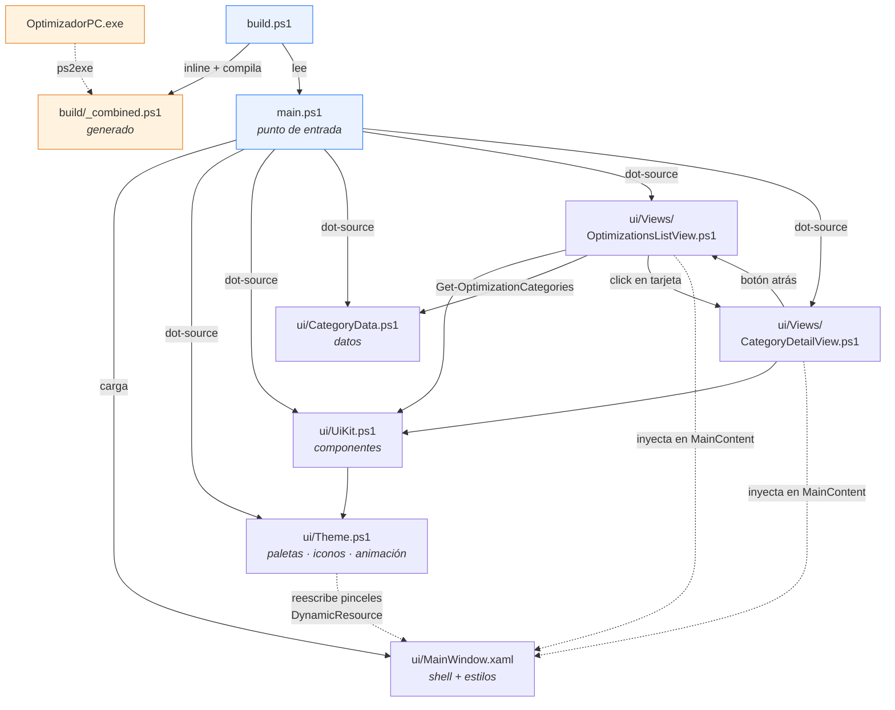
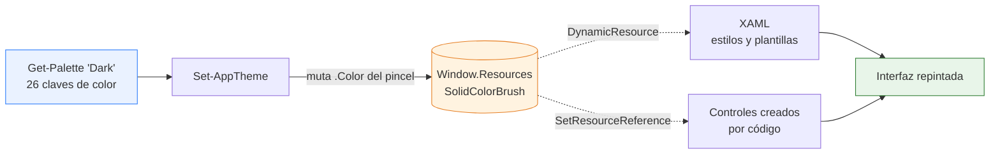
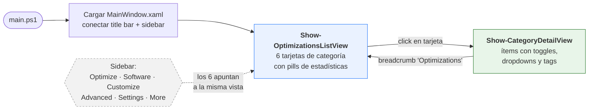
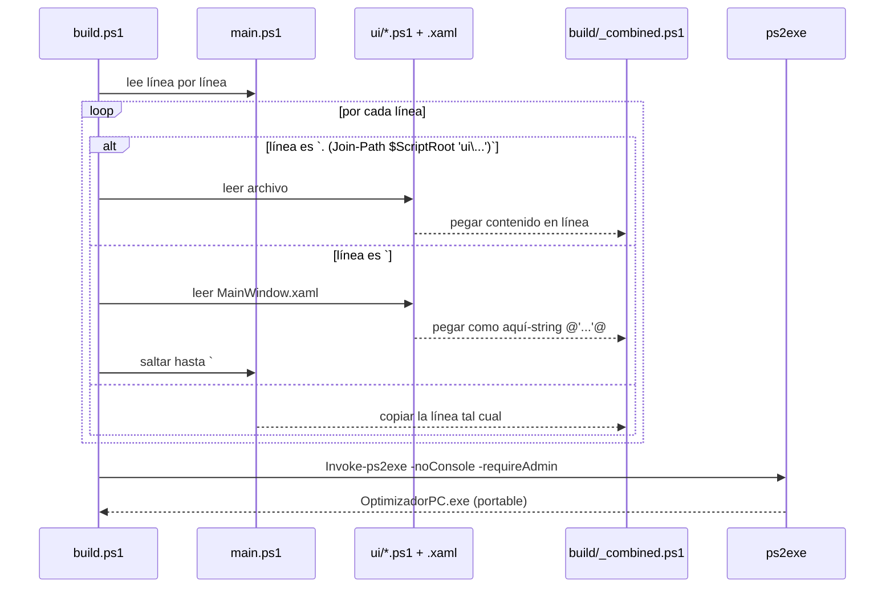

# Optimizador PC

Aplicación de escritorio para optimizar Windows 11 Pro. Interfaz **WPF** escrita íntegramente en **PowerShell 5.1** y empaquetada como un **`.exe` portable de un solo archivo** con [ps2exe](https://github.com/MScholtes/PS2EXE).

> **Estado: maqueta de interfaz.** La navegación, las tarjetas, los toggles y los dropdowns funcionan visualmente, pero **ningún control aplica cambios reales al sistema todavía**. Los datos de `ui/CategoryData.ps1` son estáticos.

---

## Estructura del proyecto

```
Proyecto/
├── main.ps1                 Punto de entrada: XAML, tema y eventos
├── build.ps1                Empaquetador (inline) + compilador a .exe
├── OptimizadorPC.exe        Binario portable generado
├── CLAUDE.md                Contexto y reglas para asistentes de IA
├── README.md                Este archivo
│
├── ui/
│   ├── MainWindow.xaml      Shell + sistema de diseño (estilos, plantillas)
│   ├── Theme.ps1            Paletas claro/oscuro, iconos Fluent, animación
│   ├── UiKit.ps1            Componentes: iconos, píldoras, toggle, buscador
│   ├── CategoryData.ps1     Datos de categorías e ítems (solo datos)
│   └── Views/
│       ├── OptimizationsListView.ps1   Pantalla 1: tarjetas de categorías
│       └── CategoryDetailView.ps1      Pantalla 2: ítems con toggles/dropdowns
│
├── assets/
│   └── icons/               (vacía — los iconos son la fuente Segoe Fluent Icons)
│
└── build/
    └── _combined.ps1        GENERADO: todo el proyecto en un solo script
```

### Diagrama de módulos



### Sistema de diseño

Toda la apariencia sale de un único sitio: los recursos de `MainWindow.xaml`.

| Capa | Dónde | Qué aporta |
| ---- | ----- | ---------- |
| Paleta | `Theme.ps1` → `Get-Palette` | 26 claves de color, en versión clara y oscura |
| Recursos | `MainWindow.xaml` → `Window.Resources` | Las mismas 26 claves como `SolidColorBrush` |
| Estilos | `MainWindow.xaml` | Plantillas de botón, combo, scrollbar, tooltip, tarjeta |
| Componentes | `UiKit.ps1` | Iconos, píldoras, etiquetas, toggle animado, buscador |
| Tipografía | Segoe UI Variable (Display / Text) | Fuente nativa de Windows 11 |
| Iconos | Segoe Fluent Icons | Vectoriales, nativos, sin dependencias externas |

**Cambio de tema en vivo:** el XAML consume los colores con `{DynamicResource}` y el
código con `SetResourceReference`, así que `Set-AppTheme` solo tiene que reescribir
el color de cada pincel y toda la interfaz —incluida la ya construida— se repinta
sola, sin reconstruir ninguna vista.



---

## Cómo funciona la interfaz

`MainWindow.xaml` define un shell fijo (barra de título sin bordes, sidebar de navegación y cabecera). Las vistas **no** son archivos XAML: se construyen en código y se inyectan en tres contenedores nombrados.

| Contenedor XAML      | Qué recibe                                    |
| -------------------- | --------------------------------------------- |
| `HeaderTitleArea`    | Título grande o breadcrumb                     |
| `HeaderActionsArea`  | Buscador, "Quick Actions", "View"              |
| `MainContent`        | El cuerpo de la vista (lista de tarjetas)      |

Cada vista limpia esos contenedores y los repuebla, así que **cambiar de pantalla no recrea la ventana**.

### Efectos y transiciones

| Efecto | Dónde vive | Detalle |
| ------ | ---------- | ------- |
| Entrada de vista | `Start-EnterTransition` | Desvanecido + deslizamiento de 14px, 260 ms, `CubicEase` |
| Elevación de tarjeta | `Add-HoverLift` | Sube 2px y la sombra pasa de 8 a 20 de desenfoque, 160 ms |
| Interruptor | `New-ToggleSwitch` | `ColorAnimation` de la pista + `DoubleAnimation` del pomo |
| Estados hover/foco | Triggers del XAML | Borde, fondo y color de texto por `ControlTemplate.Triggers` |
| Selección lateral | `DataTrigger` sobre `Tag` | Píldora de acento + barra indicadora |
| Scrollbar | Plantilla propia | 6px, se ensancha a 8px al pasar el ratón |

Las animaciones que usan `RenderTransform` o `Effect` **crean la instancia en código**,
no en un `Setter` del estilo: un `Freezable` declarado en un `Setter` se comparte entre
todos los controles del estilo y WPF no deja animarlo.

### Flujo de navegación



### Categorías definidas

| Id              | Categoría              | Badge  | Ítems reales |
| --------------- | ---------------------- | ------ | ------------ |
| `privacy`       | Privacy & Security     | NEW 45 | 6            |
| `power`         | Power                  | —      | 3            |
| `gaming`        | Gaming & Performance   | NEW 16 | 5            |
| `update`        | Update                 | NEW 1  | 2            |
| `notifications` | Notifications          | —      | 2            |
| `sound`         | Sound                  | —      | 1            |

> Los contadores que muestran las tarjetas (`Recommended 29/88`, etc.) son **valores decorativos**, no cuentan los ítems reales de la lista.

Cada ítem tiene `Name`, `Description`, `Tags` (`Preference` / `Recommended` / `Default` / `Custom`) y un `Type` de control: `Toggle` o `Dropdown`.

---

## Compilación

`build.ps1` existe porque ps2exe solo acepta **un** archivo de entrada, y el `.exe` debe ser portable sin arrastrar la carpeta `ui/` al lado.



### Comandos

```powershell
# Desarrollo: ejecutar directo, sin compilar (mucho más rápido)
powershell -ExecutionPolicy Bypass -File .\main.ps1

# Compilar el ejecutable portable
powershell -ExecutionPolicy Bypass -File .\build.ps1
```

`build.ps1` instala el módulo `ps2exe` automáticamente en `CurrentUser` si falta (no requiere admin para instalarlo). El `.exe` resultante se compila con `-requireAdmin`, así que **pedirá elevación al abrirse**.

---

## Convenciones importantes

1. **Nunca edites `build/_combined.ps1`** — se regenera en cada build.
2. **`build.ps1` parsea `main.ps1` con expresiones regulares.** Si agregas un archivo en `ui/`, el dot-source debe escribirse exactamente así o no entrará al `.exe`:
   ```powershell
   . (Join-Path $ScriptRoot 'ui\MiArchivo.ps1')
   ```
3. **Guarda todo `.ps1` y `.xaml` en UTF-8 CON BOM.** Windows PowerShell 5.1 interpreta un script sin BOM como ANSI y rompe cualquier carácter no ASCII, fallando al parsear. Como PowerShell 7 sí asume UTF-8, un archivo puede funcionar en `pwsh` y reventar en `powershell`.
4. **Los handlers de eventos no deben usar `.GetNewClosure()`.** El closure los liga a un módulo dinámico donde las funciones del script son invisibles (*"Show-CategoryDetailView is not recognized"* al hacer clic). Pasa el dato por `$control.Tag` y obtén la ventana con `[System.Windows.Window]::GetWindow($s)`.
5. **Sin consola en el `.exe`**: `Write-Host` no se ve. Depura ejecutando `main.ps1` directamente.
6. **Prueba en los dos hosts.** El `.exe` corre en ámbito global bajo PowerShell 5.1 y `main.ps1` en ámbito de script bajo PowerShell 7: hay fallos que solo se manifiestan en uno. Que el `.exe` funcione no significa que el script esté bien, y viceversa.

---

## Pendiente

- [ ] Lógica real de tweaks (registro, servicios, planes de energía) en módulos separados de `ui/`
- [ ] Leer el estado real del sistema en vez del `Value` estático de `CategoryData.ps1`
- [ ] Restauración / rollback por tweak
- [ ] Diferenciar las 6 entradas del sidebar (hoy las seis abren la misma vista)
- [ ] Funcionalidad de búsqueda, "Quick Actions", "View" y "Reset" (hoy son decorativos)
- [ ] Recordar el tema elegido entre sesiones
- [ ] Contadores de estadísticas calculados en vez de fijos
