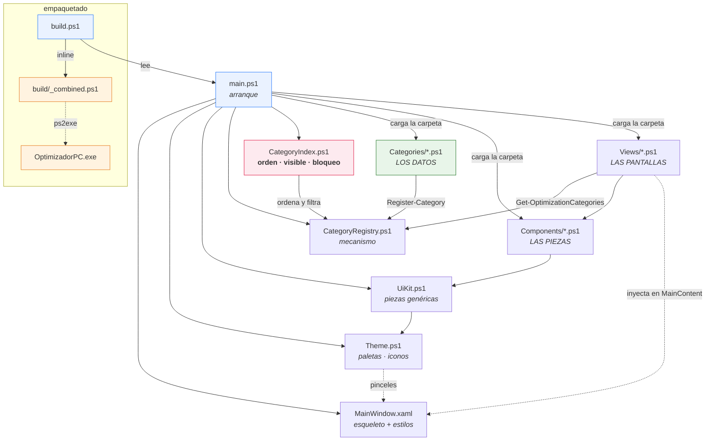
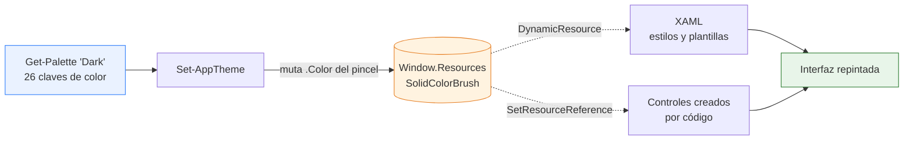
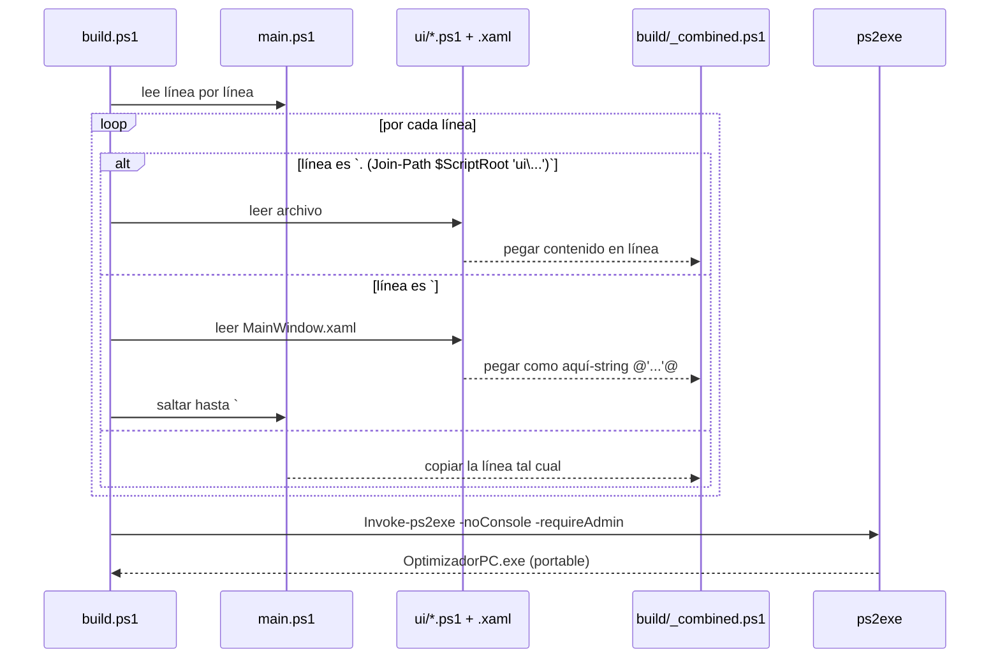

# Optimizador PC

Aplicación de escritorio para optimizar Windows 11 Pro. Interfaz **WPF** escrita íntegramente en **PowerShell 5.1** y empaquetada como un **`.exe` portable de un solo archivo** con [ps2exe](https://github.com/MScholtes/PS2EXE).

> **Estado: maqueta de interfaz.** La navegación, las tarjetas, los toggles y los dropdowns funcionan visualmente, pero **ningún control aplica cambios reales al sistema todavía**. Los datos de `ui/Categories/` son estáticos.

---

## Estructura del proyecto

Cada archivo tiene **una sola responsabilidad**. La regla general: para cambiar algo,
solo deberías tener que abrir un archivo.

```
Proyecto/
├── main.ps1                 Arranque: carga todo, aplica tema, conecta la ventana
├── build.ps1                Empaquetador (inline) + compilador a .exe
├── OptimizadorPC.exe        Binario portable generado
│
├── ui/
│   ├── MainWindow.xaml      ESQUELETO + ESTILOS: barra de título, contenedores
│   │                        vacíos y todas las plantillas visuales
│   ├── Theme.ps1            Paletas claro/oscuro, catálogo de iconos, animaciones
│   ├── UiKit.ps1            Piezas genéricas: icono, píldora, etiqueta,
│   │                        interruptor, buscador, botón chip, rejillas
│   │
│   ├── CategoryIndex.ps1    ← PRINCIPAL: qué secciones se ven, en qué orden
│   │                          y cuáles están bloqueadas
│   ├── NavigationIndex.ps1  ← PRINCIPAL: los botones del menú lateral
│   ├── CategoryRegistry.ps1 Mecanismo para declarar secciones (sin datos)
│   │
│   ├── Categories/          ← LOS DATOS. Un archivo por sección.
│   │   ├── Privacy.ps1
│   │   ├── Power.ps1
│   │   ├── Gaming.ps1
│   │   ├── Update.ps1
│   │   ├── Notifications.ps1
│   │   └── Sound.ps1
│   │
│   ├── Components/          ← LAS PIEZAS. Cómo se dibuja cada cosa.
│   │   ├── PageHeader.ps1       cabecera: título, breadcrumb, acciones
│   │   ├── CategoryCard.ps1     fila de la pantalla principal
│   │   ├── SettingCard.ps1      fila de la pantalla de detalle
│   │   ├── Banner.ps1           avisos (p. ej. "sección bloqueada")
│   │   └── Sidebar.ps1          menú lateral: botones y plegado animado
│   │
│   └── Views/               ← LAS PANTALLAS. Solo ensamblan piezas.
│       ├── OptimizationsListView.ps1
│       └── CategoryDetailView.ps1
│
└── build/
    └── _combined.ps1        GENERADO: todo el proyecto en un solo script
```

### ¿Dónde toco qué?

| Quiero... | Voy a... |
| --------- | -------- |
| Reordenar, ocultar o bloquear secciones | `ui/CategoryIndex.ps1` — **el principal de las secciones** |
| Reordenar, ocultar o bloquear botones del menú | `ui/NavigationIndex.ps1` — **el principal del menú** |
| Cambiar el plegado del menú o su animación | `ui/Components/Sidebar.ps1` |
| Añadir una sección (Network, Storage...) | Crear un archivo en `ui/Categories/` (y colocarlo en el índice) |
| Quitar una sección del todo | Borrar su archivo y su línea del índice |
| Añadir/quitar un ajuste dentro de una sección | Editar el array `Items` de ese archivo |
| Cambiar el icono o el color de una sección | Campos `Icon` / `Accent` de ese archivo |
| Cambiar cómo se ve una fila de la lista | `ui/Components/CategoryCard.ps1` |
| Cambiar cómo se ve una fila del detalle | `ui/Components/SettingCard.ps1` |
| Cambiar el título o los botones de la cabecera | `ui/Components/PageHeader.ps1` |
| Cambiar los avisos | `ui/Components/Banner.ps1` |
| Cambiar colores, tipografías o iconos globales | `ui/Theme.ps1` |
| Cambiar bordes, sombras o plantillas de controles | `ui/MainWindow.xaml` |
| Añadir una pantalla nueva | Crear un archivo en `ui/Views/` |

**Las carpetas `Categories/`, `Components/` y `Views/` se cargan enteras.** Un `.ps1`
nuevo dentro de ellas entra solo, por orden alfabético — no hay que registrarlo en
`main.ps1` ni en `build.ps1`.

### El índice de secciones

`ui/CategoryIndex.ps1` es **el archivo principal de las secciones**. Manda sobre
cuáles se ven, en qué orden y cuáles están bloqueadas. El contenido de cada una
sigue en su propio archivo de `ui/Categories/`.

```powershell
$CategoryIndex = @(

    #  Id                    Visible          Bloqueada
    @{ Id = 'privacy';       Visible = $true;  Locked = $false }
    @{ Id = 'power';         Visible = $true;  Locked = $false }
    @{ Id = 'gaming';        Visible = $true;  Locked = $false }
    @{ Id = 'update';        Visible = $true;  Locked = $false }
    @{ Id = 'notifications'; Visible = $true;  Locked = $false }
    @{ Id = 'sound';         Visible = $true;  Locked = $false }

)
```

| Quiero... | Hago |
| --------- | ---- |
| Mover una sección arriba o al final | Mover su línea en la lista |
| Ocultarla sin perderla | `Visible = $false` |
| Mostrarla pero que no se pueda tocar | `Locked = $true` |
| Quitarla temporalmente | Comentar su línea con `#` |
| Volver a ponerla | Descomentar la línea |

Ocultar o quitar del índice **no borra nada**: el archivo de `ui/Categories/` sigue
intacto y la sección vuelve en cuanto la reactivas.

**Qué hace `Locked = $true`:** la sección aparece en la lista con un candado, se puede
abrir y consultar, pero dentro sale un aviso, los interruptores y desplegables quedan
deshabilitados en gris y el botón *Reset* se apaga. No es solo un efecto visual —
los controles llevan `IsEnabled = $false`, así que WPF no les entrega el ratón.

**Y si creo un archivo y no lo pongo en el índice:** aparece igualmente, al final de
la lista y desbloqueado. Así añadir una sección sigue siendo crear un archivo y ya;
el índice solo hace falta cuando quieres colocarla, ocultarla o bloquearla.
`Get-UnlistedCategories` devuelve las que están en ese caso.

### El menú lateral

`ui/NavigationIndex.ps1` hace con los botones de la izquierda lo mismo que
`CategoryIndex.ps1` con las secciones. Antes estaban escritos a mano en el XAML;
ahora son datos y los dibuja `ui/Components/Sidebar.ps1`.

```powershell
$NavigationIndex = @(

    #  Id             Icono        Etiqueta       Grupo      Visible  Bloqueado
    @{ Id = 'software';  Icon = 'Apps';    Label = 'Software';  Group = 'Top';    Visible = $true; Locked = $false }
    @{ Id = 'optimize';  Icon = 'Gauge';   Label = 'Optimize';  Group = 'Top';    Visible = $true; Locked = $false; Default = $true }
    @{ Id = 'customize'; Icon = 'Palette'; Label = 'Customize'; Group = 'Top';    Visible = $true; Locked = $false }

    @{ Id = 'advanced';  Icon = 'Wrench';  Label = 'Advanced';  Group = 'Bottom'; Visible = $true; Locked = $false }
    @{ Id = 'settings';  Icon = 'Gear';    Label = 'Settings';  Group = 'Bottom'; Visible = $true; Locked = $false }
    @{ Id = 'more';      Icon = 'More';    Label = 'More';      Group = 'Bottom'; Visible = $true; Locked = $false }

)
```

| Campo | Para qué |
| ----- | -------- |
| Orden de la lista | El orden en que salen los botones, dentro de cada grupo |
| `Group` | `'Top'` arriba, `'Bottom'` pegado abajo tras la línea separadora |
| `Visible` | `$false` lo oculta sin borrar nada |
| `Locked` | `$true` lo muestra con candado, en gris y sin responder al clic |
| `Default` | El botón que sale marcado al arrancar |
| `Icon` | Nombre de glifo del catálogo de `ui/Theme.ps1` |

Añadir una entrada al menú es añadir una línea aquí. Aunque los botones ya no estén
en el XAML, siguen registrados con su nombre, así que `$Window.FindName('NavSettings')`
funciona igual que antes.

### Plegar el menú

El botón de las tres líneas de la barra de título pliega y despliega el panel con una
animación de 220 ms (`CubicEase`): el ancho baja de 88 px a 0 y el contenido se
desvanece un poco antes para que no se vea recortado a medio camino.

Se anima el **ancho del `Border`**, no la columna del `Grid`: la columna es `Auto` y
sigue al `Border` sola. Animar un `GridLength` directamente requeriría una animación
propia, porque WPF no trae ninguna. El borde derecho de 1 px se retira al plegar,
que si no el ancho nunca llegaría a cero del todo.

### Cómo se declara una sección

```powershell
Register-Category @{
    Id          = 'network'             # identificador único
    Name        = 'Network & Latency'   # título visible
    Icon        = 'Bolt'                # glifo del catálogo de Theme.ps1
    Accent      = 'Accent'              # color del icono (clave del tema)
    AccentSoft  = 'AccentSoft'          # fondo del icono
    Badge       = 'NEW 3'               # distintivo rojo ($null para ocultarlo)
    Description = 'TCP tuning, Nagle, DNS, adapter power'

    Recommended = 11; Default = 14; Custom = 1; Total = 26

    Items = @(
        New-Setting -Name 'Nagle Algorithm' `
            -Description 'Disable packet coalescing to reduce input latency' `
            -Tags 'Preference', 'Recommended' `
            -Value $false

        New-Setting -Name 'DNS Provider' `
            -Description 'Choose which resolver Windows uses' `
            -Tags 'Preference', 'Custom' `
            -Options 'Automatic (DHCP)', 'Cloudflare 1.1.1.1', 'Google 8.8.8.8' `
            -Value 'Cloudflare 1.1.1.1'
    )
}
```

`New-Setting` deduce el control solo: **con `-Options` es un desplegable, sin
`-Options` es un interruptor** (y entonces `-Value` debe ser `$true` / `$false`).
Solo `Id`, `Name`, `Icon`, `Description` e `Items` son obligatorios; el resto tiene
valores por defecto.

### Diagrama de módulos



### Sistema de diseño

Toda la apariencia sale de un único sitio: los recursos de `MainWindow.xaml`.

| Capa | Dónde | Qué aporta |
| ---- | ----- | ---------- |
| Paleta | `Theme.ps1` → `Get-Palette` | 26 claves de color, en versión clara y oscura |
| Recursos | `MainWindow.xaml` → `Window.Resources` | Las mismas 26 claves como `SolidColorBrush` |
| Estilos | `MainWindow.xaml` | Plantillas de botón, combo, scrollbar, tooltip, tarjeta |
| Componentes | `UiKit.ps1` | Iconos, píldoras, etiquetas, toggle animado, buscador |
| Tipografía | Segoe UI Variable (Display / Text) | Fuente nativa de Windows 11 |
| Iconos | Segoe Fluent Icons | Vectoriales, nativos, sin dependencias externas |

**Cambio de tema en vivo:** el XAML consume los colores con `{DynamicResource}` y el
código con `SetResourceReference`, así que `Set-AppTheme` solo tiene que reescribir
el color de cada pincel y toda la interfaz —incluida la ya construida— se repinta
sola, sin reconstruir ninguna vista.



## Cómo funciona la interfaz

`MainWindow.xaml` define un shell fijo (barra de título sin bordes, sidebar de navegación y cabecera). Las vistas **no** son archivos XAML: se construyen en código y se inyectan en tres contenedores nombrados.

| Contenedor XAML      | Qué recibe                                    |
| -------------------- | --------------------------------------------- |
| `HeaderTitleArea`    | Título grande o breadcrumb                     |
| `HeaderActionsArea`  | Buscador, "Quick Actions", "View"              |
| `MainContent`        | El cuerpo de la vista (lista de tarjetas)      |

Las vistas no tocan esas zonas directamente: pasan por `ui/Components/PageHeader.ps1`, que las limpia y las repuebla. Así **cambiar de pantalla no recrea la ventana** y todas las pantallas comparten el mismo aspecto de cabecera.

### Efectos y transiciones

| Efecto | Dónde vive | Detalle |
| ------ | ---------- | ------- |
| Entrada de vista | `Start-EnterTransition` | Desvanecido + deslizamiento de 14px, 260 ms, `CubicEase` |
| Elevación de tarjeta | `Add-HoverLift` | Sube 2px y la sombra pasa de 8 a 20 de desenfoque, 160 ms |
| Interruptor | `New-ToggleSwitch` | `ColorAnimation` de la pista + `DoubleAnimation` del pomo |
| Estados hover/foco | Triggers del XAML | Borde, fondo y color de texto por `ControlTemplate.Triggers` |
| Selección lateral | `DataTrigger` sobre `Tag` | Píldora de acento + barra indicadora |
| Scrollbar | Plantilla propia | 6px, se ensancha a 8px al pasar el ratón |

Las animaciones que usan `RenderTransform` o `Effect` **crean la instancia en código**,
no en un `Setter` del estilo: un `Freezable` declarado en un `Setter` se comparte entre
todos los controles del estilo y WPF no deja animarlo.

### Flujo de navegación


### Categorías definidas

Una fila por archivo de `ui/Categories/`. El orden mostrado es el de `ui/CategoryIndex.ps1`:

| Archivo | Id | Categoría | Icono | Badge | Ajustes |
| ------- | -- | --------- | ----- | ----- | ------- |
| `Privacy.ps1` | `privacy` | Privacy & Security | `Shield` | NEW 45 | 6 |
| `Power.ps1` | `power` | Power | `Power` | — | 3 |
| `Gaming.ps1` | `gaming` | Gaming & Performance | `Game` | NEW 16 | 5 |
| `Update.ps1` | `update` | Update | `Sync` | NEW 1 | 2 |
| `Notifications.ps1` | `notifications` | Notifications | `Bell` | — | 2 |
| `Sound.ps1` | `sound` | Sound | `Volume` | — | 1 |

> Los contadores de las píldoras (`29/88`, etc.) y los badges son **valores fijos declarados a mano**, no cuentan los ajustes reales del archivo. Cuando haya lógica real conviene calcularlos.


---

## Compilación

`build.ps1` existe porque ps2exe solo acepta **un** archivo de entrada, y el `.exe` debe ser portable sin arrastrar la carpeta `ui/` al lado.



### Comandos

```powershell
# Desarrollo: ejecutar directo, sin compilar (mucho más rápido)
powershell -ExecutionPolicy Bypass -File .\main.ps1

# Compilar el ejecutable portable
powershell -ExecutionPolicy Bypass -File .\build.ps1
```

`build.ps1` instala el módulo `ps2exe` automáticamente en `CurrentUser` si falta (no requiere admin para instalarlo). El `.exe` resultante se compila con `-requireAdmin`, así que **pedirá elevación al abrirse**.

---

## Convenciones importantes

1. **Nunca edites `build/_combined.ps1`** — se regenera en cada build.
2. **`build.ps1` parsea `main.ps1` con expresiones regulares.** Si agregas un archivo en `ui/`, el dot-source debe escribirse exactamente así o no entrará al `.exe`:
   ```powershell
   . (Join-Path $ScriptRoot 'ui\MiArchivo.ps1')
   ```
3. **Guarda todo `.ps1` y `.xaml` en UTF-8 CON BOM.** Windows PowerShell 5.1 interpreta un script sin BOM como ANSI y rompe cualquier carácter no ASCII, fallando al parsear. Como PowerShell 7 sí asume UTF-8, un archivo puede funcionar en `pwsh` y reventar en `powershell`.
4. **Los handlers de eventos no deben usar `.GetNewClosure()`.** El closure los liga a un módulo dinámico donde las funciones del script son invisibles (*"Show-CategoryDetailView is not recognized"* al hacer clic). Pasa el dato por `$control.Tag` y obtén la ventana con `[System.Windows.Window]::GetWindow($s)`.
5. **Sin consola en el `.exe`**: `Write-Host` no se ve. Depura ejecutando `main.ps1` directamente.
6. **Prueba en los dos hosts.** El `.exe` corre en ámbito global bajo PowerShell 5.1 y `main.ps1` en ámbito de script bajo PowerShell 7: hay fallos que solo se manifiestan en uno. Que el `.exe` funcione no significa que el script esté bien, y viceversa.

---

## Pendiente

- [ ] Lógica real de tweaks (registro, servicios, planes de energía) en módulos separados de `ui/`
- [ ] Leer el estado real del sistema en vez del `Value` estático de los archivos de `ui/Categories/`
- [ ] Restauración / rollback por tweak
- [ ] Diferenciar las 6 entradas del sidebar (hoy las seis abren la misma vista)
- [ ] Funcionalidad de búsqueda, "Quick Actions", "View" y "Reset" (hoy son decorativos)
- [ ] Recordar el tema elegido entre sesiones
- [ ] Contadores de estadísticas calculados en vez de fijos
